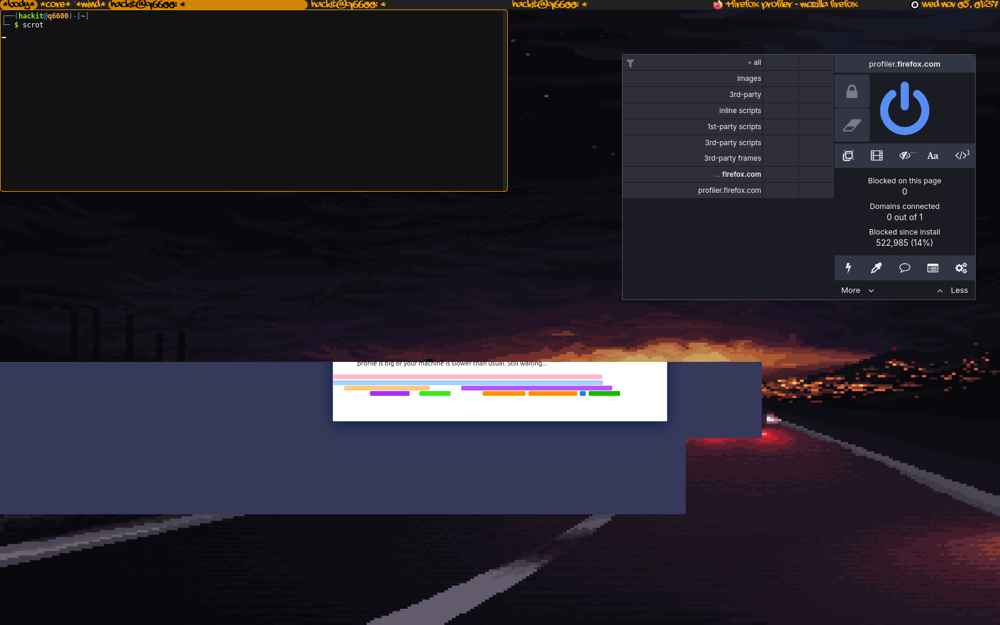
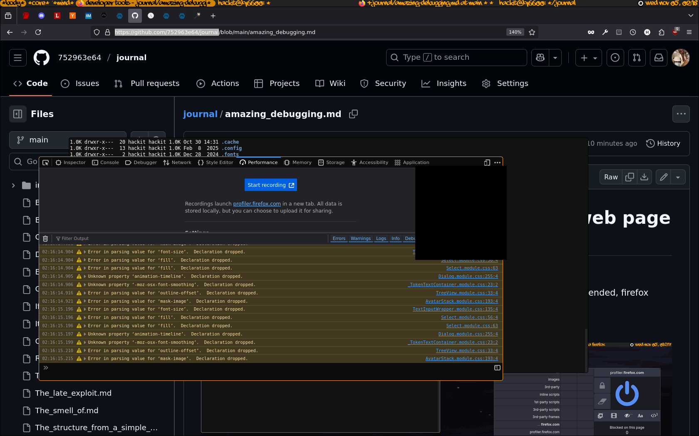

# Amazing moment awhile debugging a web page looking for crypto miner

My damn CPU is running at 50% on a static web page which is deepai... :D

Awhile profiling the thingy eating my CPU seemed to stop processing and when profiling ended, firefox were running normally without eating my damn CPU...

but when I tried to see the profile, this happened! :D

## developer tools or Developer problems?

- blackened menu, the meal is black! damn it, I'm cursed sure... :D

## UPDATE 6/11/2025

- found out it's my import that makes menu from dev tool black... while using a new profile everything is OKAY!

- deepai doesn't consume my CPU anymore! dunno what has been done, I'm using the stricly same setup.
